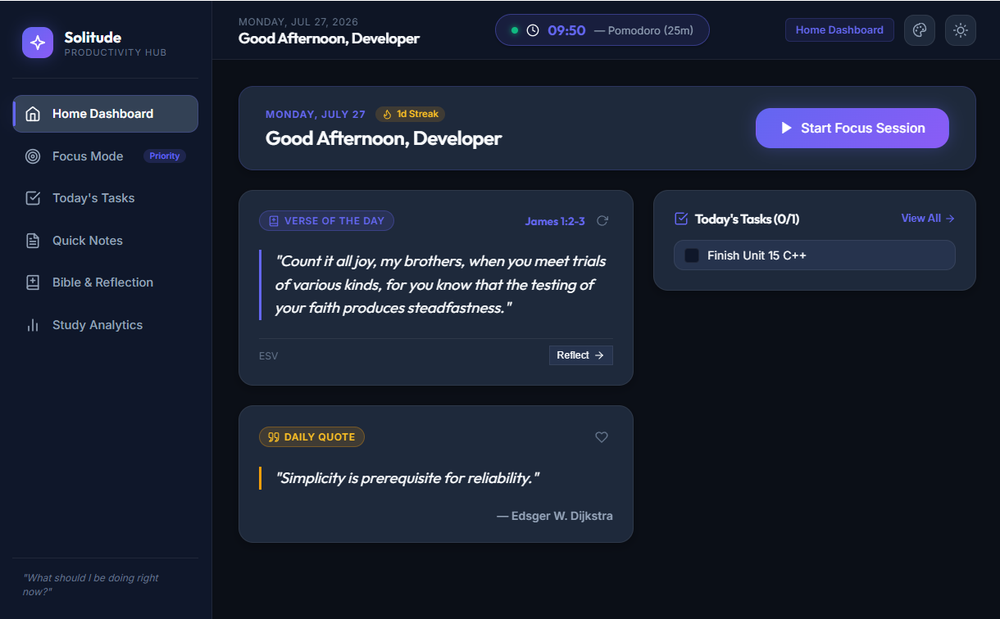

# 🌌 Solitude — Personal Productivity Hub

[](https://github.com/exowynt/productivity-app/releases)
[](LICENSE)
[](https://github.com/exowynt/productivity-app/releases)
[](https://github.com/exowynt/productivity-app)

> **A sleek, minimalist desktop application designed to eliminate distraction, boost focus, and harmonize daily work with daily reflection.**

---



---

## ✨ Features at a Glance

### ⚡ **Focus Mode Centerpiece**
* **Pomodoro & Custom Timers:** Quick presets (15m, 25m Pomodoro, 45m Deep Study, 60m Power Hour, 5m Break) plus custom minute inputs.
* **Persistent Background Execution:** Timer runs continuously across all tabs without resetting when navigating between Dashboard, Tasks, Notes, Bible, or Analytics.
* **Live Header Status Pill:** Active countdown display (`00:00 — Deep Study Session`) right in the top navigation bar.
* **Completion Chime & Notifications:** Plays a Web Audio harmonic chime (`D5 -> A5`) and triggers native Windows desktop notifications when sessions finish.

### 🎨 **9 Curated Color Theme Presets**
* Instantly switch color schemes via the top-bar Palette icon (`🎨`):
  1. **Midnight Slate** *(Default Sleek Indigo/Dark Navy)*
  2. **Dracula** *(Vampire Dark with Pink `#FF79C6` & Cyan accents)*
  3. **Nordic Frost** *(Arctic Slate Blue `#2E3440` & Ice Cyan `#88C0D0`)*
  4. **Catppuccin Mocha** *(Soothing Pastel Mauve `#CBA6F7` & Charcoal)*
  5. **Tokyo Night** *(Neon Cyberpunk Navy `#1A1B26` & Electric Blue)*
  6. **Rosé Pine** *(Cozy Dark Rose Gold `#EBBCBA` & Pine)*
  7. **One Dark Pro** *(Atom Classic Dark with Vibrant Blue `#61AFEF`)*
  8. **Solarized Dark** *(Precision Blue-Green `#002B36` & Cyan)*
  9. **Paper & Ink** *(Crisp Light Mode with Deep Indigo accents)*

### ⚡ **Dual Layout Density Modes**
* **🌿 Calm Spacious (Default):** Generous margins, comfortable action buttons, and spacious cards.
* **⚡ Sleek Compact:** Condensed padding, tighter header (`56px`), smaller button heights, and high information density.

### 📖 **365 Unique Bible Verses & Reflection Journal**
* **Zero Repeat Annual Engine:** 365 authentic, verified ESV Scripture verses (Genesis through Revelation). Guaranteed 0 repeated verses for an entire year!
* **Verse Refresh & Favorites:** Refresh icon button (`🔄`) to draw new Scripture on demand and heart button (`❤️`) to bookmark verses.
* **Date-Stamped Spiritual Journal:** Daily Reflection journal editor with saved history log.

### 📋 **Daily Task Checklist & Sticky Notes**
* **Prioritized Tasks:** Drag/order tasks up and down, toggle completion, live progress bar, and instant clearing.
* **Digital Sticky Notes:** Color-coded digital sticky notes (Indigo, Emerald, Amber, Rose, Violet), pinning, and inline editing.

### 📊 **Study Analytics & History Log**
* **KPI Metrics:** Track today's focus minutes, current streak (`🔥 5d Streak`), weekly totals, and completed sessions.
* **Visual Charts:** Interactive Weekly Focus Bar Chart & Category breakdown progress bars.
* **Instant Session History:** Completed and manual sessions log on screen with zero delay.

---

## 📥 Download & Installation

### Option 1: Installer Executable (Recommended)
1. Download the latest installer **[Solitude Productivity Hub Setup 1.0.0.exe](https://github.com/exowynt/productivity-app/releases)** from GitHub Releases.
2. Run the installer to set up Solitude on your Windows computer with Desktop and Start Menu shortcuts.

### Option 2: Portable Executable
1. Download **[Solitude Productivity Hub 1.0.0.exe](https://github.com/exowynt/productivity-app/releases)**.
2. Run directly without installation.

---

## 🛠️ Local Development & Build Setup

### Prerequisites
* [Node.js](https://nodejs.org/) (v18 or higher recommended)
* npm (v9+)

### Installation
```bash
# 1. Clone the repository
git clone https://github.com/exowynt/productivity-app.git
cd productivity-app

# 2. Install dependencies
npm install

# 3. Launch live development environment
npm run dev
```

### Packaging & Executable Build
```bash
# Build Vite renderer & TypeScript main process
npm run build

# Package Windows setup installer & portable executable into release/
npm run dist
```

---

## 📂 Project Architecture

```
productivity-app/
├── assets/                  # App brand logo & preview screenshots
├── build/                   # App icon files (icon.png, icon.ico, icon.svg)
├── scripts/                 # Node icon generator scripts
├── src/
│   ├── main/                # Electron main process (index.ts, preload.ts, storage.ts)
│   ├── renderer/
│   │   ├── components/      # UI components (Header, Sidebar, ThemeModal, Icons)
│   │   ├── context/         # React Contexts (StorageContext, TimerContext)
│   │   ├── features/        # Feature Views (Dashboard, Focus, Tasks, Notes, Bible, Stats)
│   │   ├── hooks/           # Custom React hooks (useStorage, useTimer, useTheme, useDensity)
│   │   ├── utils/           # Utilities (dailyInspiration, focusMetrics)
│   │   ├── app.tsx          # Main React Application shell
│   │   └── index.css        # Global CSS design system & theme variables
│   └── shared/              # Shared TypeScript types & theme preset definitions
├── package.json
├── vite.config.ts
└── tsconfig.json
```

---

## 📜 License

This project is licensed under the **MIT License** — see the [LICENSE](LICENSE) file for details.

Developed with ❤️ by [exowynt](https://github.com/exowynt).
